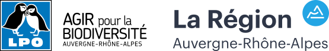

# GeoNature-BiodivTerritoires

Portail de restitution de la biodiversité des territoires pour un porté à connaissance dans le cadre des programmes d'aménagements.

## Démo

Une démo, couvrant le territoire de l'Ardèche est disponible à cette adresse: https://biodiv-territoires-demo.lpo-aura.org/

## Contexte

La diffusion des connaissances naturalistes dans un but de conservation est un 
objectif fort de la LPO Auvergne-Rhône-Alpes et plus généralement pour les acteurs 
de l'environnement. 

Dans ce but là, la LPO travaille depuis 2014 sur une restitution des données 
naturalistes. En 2018, des évolutions ont été réalisées pour déployer l’outil 
opensource Géonature-Atlas (https://carto.fauneauvergnerhonealpes.org) et 
intégrer les connaissances de nos partenaires associatifs auvergnats 
(Groupe Mammalogique d’Auvergne, Chauve-Souris Auvergne, Observatoire des Reptiles 
d’Auvergne, CPIEs d’Auvergne).

### L'origine du projet

En 2019, la LPO Auvergne-Rhône-Alpes a pour projet la création d’un portail 
internet de restitution "Biodiversité dans les PLU(i)", une plateforme de 
restitution publique spécialisée pour les acteurs du territoire.

Actuellement la prise en compte de la biodiversité dans les PLU(i) est très 
hétérogène et souvent sous traitée (problème d'accessibilité aux données, manques 
de moyens, etc.). L’objectif de cet outil est de produire un portail de restitution 
des connaissances adapté pour une meilleure accessibiltié et prise en compte de ces 
enjeux dans les documents d’urbanisme. Il pourrait donner accès, à l’échelle d’un 
périmètre géographique pré-défini (collectivité), à la synthèse des enjeux du 
territoire, et à certaines évaluations :

- Etat des connaissances (niveau et répartition des connaissances naturaliste) ;
- Nombre, liste et statut des espèces connues ;
- Identification des espèces à enjeux connues en fonction des données à disposition 
(période de présence, statut biologique) ;
- Liste des zones naturelles d’un territoire et synthèses détaillées par zonages ;
- etc.

Ce portail pourrait intégrer les enjeux et connaissances des autres groupes 
taxonomiques, issues des pôles flore et invertébrés. Par ailleurs, l’entrée 
présentée ici est celle des PLU(i) mais d’autres projets pourront bénéficier 
de ces informations (Atlas de Biodiversité Communal par exemple) et d’autres 
périmètres pourront à terme être pris en compte.

Ce projet vise prioritairement les acteurs à l’initiative des projets d’aménagements 
du territoire, notamment les collectivités (en charge des programmes d’aménagements) 
et les bureaux d’études, qui accompagnent les collectivités.

### A propos de cette première version

Cette application internet est sous licence opensource 
([GNU Affero General Public License AGPL-3.0](https://www.gnu.org/licenses/agpl-3.0.fr.html)). 
Elle est basée sur l’application GeoNature, développée par un [collectif](https://docs.geonature.fr/authors.html) et pilotée 
par le [Parc national des Ecrins](http://www.ecrins-parcnational.fr/). Soulignons 
que les développements prévus en 2019 prévoient la mise en service d’une première 
version de cette application avec les principales informations attendues. Ils ne 
couvriront cependant pas la totalité des objectifs présentés ci-après.

Ce chapitre présente la structuration et le contenu prévu pour cette application 
internet. Elle est prévue en 3 parties principales :

- L’accueil de la plateforme, point d’entrée de l’application ;
- La fiche territoire, qui contiendra un une page unique toutes les informations relatives à un territoire ;
- Un espace « Données » qui listera les ressources en ligne disponibles (données téléchargeables et flux de données en ligne (données cartographiques notamment, au format JSON/GeoJSON ou WMS/WFS)).

La plateforme disposera également des élément suivants :
- Une page « A propos », contenant une présentation de la plateforme ;
- Une page « Mentions légales » permettant de renseigner les informations légales obligatoires ;
- Une page « Conception & crédits » listant les informations ;
- Un dispositif de gestion de contenu éditorial (articles, actualités).

## Démo

Une démo, couvrant le territoire de l'Ardèche est disponible à cette adresse: https://biodiv-territoires-demo.lpo-aura.org/

## Partenaires

Ce projet a été développé par la [LPO Auvergne-Rhône-Alpes](https//auvergne-rhone-alpes.lpo.fr/) avec le soutien financier de la [région Auvergne-Rhône-Alpes](https://www.auvergnerhonealpes.fr/).

 